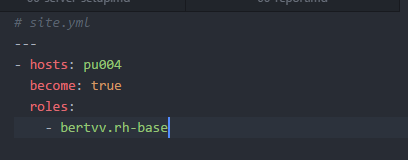
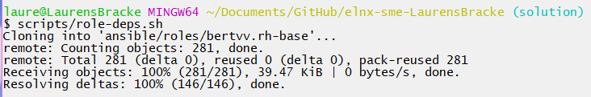
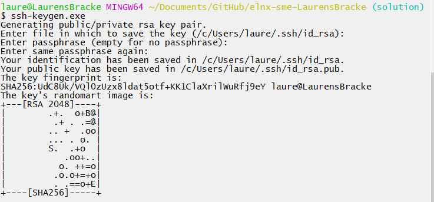
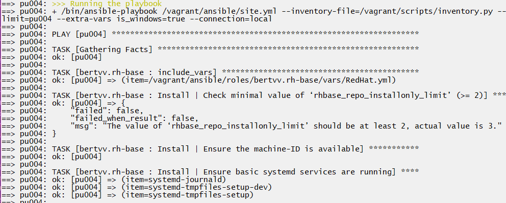
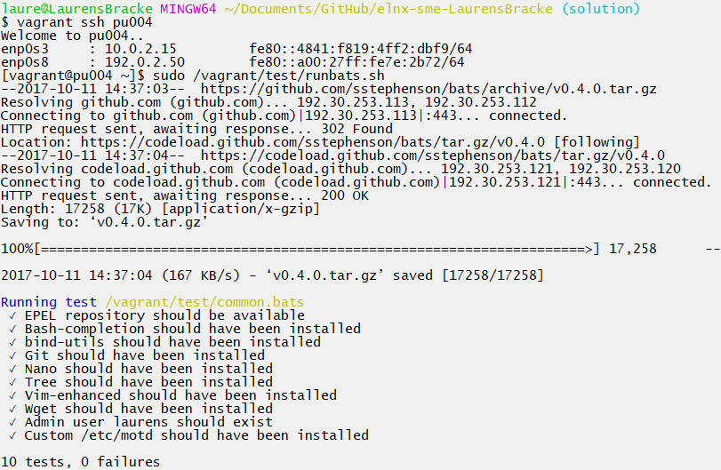
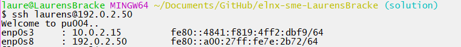

# Enterprise Linux Lab Report

- Student name: Laurens Bracke
- Github repo: <https://github.com/HoGentTIN/elnx-sme-LaurensBracke.git>

Describe the goals of the current iteration/assignment in a short sentence.

## Test plan

1. On the host system, go to the local working directory of the project repository
2. Execute `vagrant status`
    - There should be one VM, `pu004` with status `not created`. If the VM does exist, destroy it first with `vagrant destroy -f pu004`
3. Execute `vagrant up pu004`
    - The command should run without errors (exit status 0)
4. Log in on the server with `vagrant ssh pu004` and run the acceptance tests. They should succeed

    ```
    [vagrant@pu004 test]$ sudo /vagrant/test/runbats.sh
    Running test /vagrant/test/common.bats
    ✓ EPEL repository should be available
    ✓ Bash-completion should have been installed
    ✓ bind-utils should have been installed
    ✓ Git should have been installed
    ✓ Nano should have been installed
    ✓ Tree should have been installed
    ✓ Vim-enhanced should have been installed
    ✓ Wget should have been installed
    ✓ Admin user bert should exist
    ✓ Custom /etc/motd should be installed

    10 tests, 0 failures
    ```

    Any tests for the LAMP stack may fail, but this is not part of the current assignment.

5. Log off from the server and ssh to the VM as described below. You should **not** get a password prompt.

    ```
    $ ssh bert@192.0.2.50
    Welcome to pu004.localdomain.
    enp0s3     : 10.0.2.15         fe80::a00:27ff:fe5c:6428/64
    enp0s8     : 192.0.2.50        fe80::a00:27ff:fecd:aeed/64
    [bert@pu004 ~]$
    ```


## Procedure/Documentation

1. Eerst heb ik de videos bekeken die beschreven staan in de brochure over Ansible.

2. Vervolgens heb ik 'vagrant up' uitgevoerd op dit project, om er eerst voor te zorgen dat de boxes downloaden die vervolgens bewerkt worden zoals beschreven staan in de Ansible-files.

3. Voeg de role bertvv.rh-base toe aan site.yml voor `pu004`.



4. Installeer vervolgens de rol door het commando `scripts/role-deps.sh` uit te voeren. In de map Ansible/roles komt dan de rol rh-base te staan.



5. Voeg aan all.yml volgende toe voor de repository op te zetten:
  ```
  rhbase_repositories:
    - epel-release
  ```
6. Om bash-completion, bind-utils, git, nano, tree, vim-enhanced en wget toe te voegen aan elke server, voeg toe in all.yml:
  ```
  rhbase_install_packages:
    - bash-completion
    - bind-utils
    - git
    - nano
    - tree
    - vim-enhanced
    - wget
    # wget is niet verplicht hier op te nemen
  ```

  7. voeg volgende toe aan all.yml om ervoor te zorgen dat er een user `laurens` aangemaakt wordt die admin is, met paswoord `voetbal` :
  ```
  rhbase_users:
    - name: laurens
      comment: Administrator
      password: '$1$1$t.6go1hDMyB4zBqixr0q4/' (gegenereerd via 'openssl passwd -salt 1 -1 ***wachtwoord***' )
      groups:
        - wheel
  ```
  8. Nu moeten we nog onze user ssh laten gebruiken. Hiervoor moeten we eerst een key genereren. Dit doen we via het commando `ssh-keygen`.

  

  Deze key halen we dan uit het gegenereerde bestand en plakken we in all.yml onder `rhbase_ssh_key`
  We geven ook mee dat de `rhbase_ssh_user` gewoon de user `laurens` is.

  9. Als laatste zorgen we ook voor een optie zodat netwerk-info wordt getoond. Dit doen we door aan all.yml volgende toe te voegen:
  ```
  rhbase_motd: true
  ```
  10. Run eerst `vagrant up` en doe vervolgens `vagrant provision` om alles toe te passen.
  
## Test report
Bij `vagrant status` hebben we eerst moeten destroyen.


Daarna konden we `vagrant up pu004` uitvoeren.


Vervolgens wordt machine opgestart zoals normaal en wordt het playbook uitgevoerd.




We voeren de testen uit die in de map scripts/test zitten, deze leveren geen fouten op.



Vervolgens proberen we in te loggen via de ssh-user `laurens`.



Alle requirements zijn voltooid.

## Resources
 * https://github.com/bertvv/lampstack/blob/master/ansible/host_vars/lamp.yml
 * https://github.com/bertvv/ansible-role-rh-base/blob/tests/test.yml
 * https://github.com/bertvv/ansible-role-rh-base
