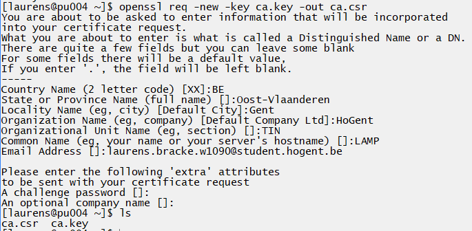

# Enterprise Linux Lab Report

- Student name: Laurens Bracke
- Github repo: <https://github.com/HoGentTIN/elnx-sme-LaurensBracke.git>

Describe the goals of the current iteration/assignment in a short sentence.

## Test plan

1. On the host system, go to the local working directory of the project repository
2. Execute `vagrant status`
    - There should be one VM, `pu004` with status `not created`. If the VM does exist, destroy it first with `vagrant destroy -f pu004`
3. Execute `vagrant up pu004`
    - The command should run without errors (exit status 0)
4. Log in on the server with `vagrant ssh pu004` and run the acceptance tests. They should succeed

    ```
    [vagrant@pu004 test]$ sudo /vagrant/test/runbats.sh
    Running test /vagrant/test/common.bats
    ✓ EPEL repository should be available
    ✓ Bash-completion should have been installed
    ✓ bind-utils should have been installed
    ✓ Git should have been installed
    ✓ Nano should have been installed
    ✓ Tree should have been installed
    ✓ Vim-enhanced should have been installed
    ✓ Wget should have been installed
    ✓ Admin user bert should exist
    ✓ Custom /etc/motd should be installed

    10 tests, 0 failures
    Running test /vagrant/test/pu004/lamp.bats
    ✓ The necessary packages should be installed
    ✓ The Apache service should be running
    ✓ The Apache service should be started at boot
    ✓ The MariaDB service should be running   
    ✓ The MariaDB service should be started at boot
    ✓ The SELinux status should be ‘enforcing’
    ✓ Web traffic should pass through the firewall
    ✓ Mariadb should have a database for Wordpress
    ✓ The MariaDB user should have "write access" to the database
    ✓ The website should be accessible through HTTP
    ✓ The website should be accessible through HTTPS
    ✓ The certificate should not be the default one
    ✓ The Wordpress install page should be visible under http://192.0.2.50/wordpress/
    ✓ MariaDB should not have a test database
    ✓ MariaDB should not have anonymous users

    ```
    Alle testen voor de LAMP-stack moeten slagen!
 5. Test of op 192.0.2.50 op de hostmachine de LAMP-stack werkt, je zou normaal de webservice moeten zien (wordpress).
 6. Test of je binnen geraakt op de databank van de LAMP-stack.
 7. Test of je Wordpress kan openen en inloggen met de ingestelde gegevens.
 8. Kijk of het https-certificaat wordt geaccepteerd door de browser.

## Procedure/Documentation

1. Voeg aan de `site.yml` volgende rollen toe:

  ```yaml
  - hosts: pu004
    become: true
    roles:
      - bertvv.rh-base
      - bertvv.mariadb
      - bertvv.httpd
      - bertvv.wordpress
  ```

2. Vervolgens gaan we ook weer de `scripts/role-deps.sh` uitvoeren, waardoor de rollen `mariadb`, `wordpress` en `httpd` worden toegevoegd.


3. Hierna gaan we eerst alles voor mariadb in orde brengen. we plakken verschillende dingen in `pu004.yml`, waaronder het root password, de user en zijn wachtwoord.

```yaml
mariadb_bind_address: '0.0.0.0'

mariadb_root_password: 'W3FqxYUS'

mariadb_users:
  - name: laurens
    password: W3FqxYUS
    priv: 'wordpress.*:ALL'
    host: '%'

mariadb_databases:
  - name: wordpress
```

4. Hierna stellen we alles voor de rol httpd in, we gaan enerzijds alle poorten open zetten die nodig zijn voor een webserver, en we laten ook php toe, omdat wordpress hiervan gebruik maakt.

```yaml
rhbase_firewall_interfaces:
  - enp0s3
  - enp0s8

rhbase_firewall_allow_services:
  - http
  - https

httpd_scripting: 'php'
```

5. Als laatste gaan we nu ook onze wordpress-gegevens meegeven. We zorgen ervoor dat de  naam van de database, de user en het wachtwoord dezelfde zijn als die van `mariadb`. We installeren ook enkele thema's mee.

```yaml
wordpress_database: wordpress

wordpress_user: laurens

wordpress_password: W3FqxYUS

wordpress_plugins:
  - name: wp-super-cache
    version: 1.4.5
wordpress_themes:
  - name: xcel
    version: 1.0.9
```

6. Als laatste moeten we nog de certificaten in orde brengen, zodat onze browser over een veilige https-connectie kan verbinden (ssl-certificaat). We gebruiken daarvoor de site die hier beneden bij Resources staat (wiki.centos.org).

7. Eerst kijken we of mod_ssl en openssl geinstalleerd zijn. Deze zijn normaal al geïnstalleerd.
```
yum install mod_ssl openssl
```

8. Vervolgens genereren we de certificaten in de home map

```
# Generate private key
openssl genrsa -out ca.key 2048

# Generate CSR
openssl req -new -key ca.key -out ca.csr

# Generate Self Signed Key
openssl x509 -req -days 365 -in ca.csr -signkey ca.key -out ca.crt

```



9. We kopiëren deze files naar ons hostsysteem en slaan ze op in de map `vagrant/keys`. Deze bestanden moeten namelijk niet iedere keer aangemaakt worden. We zorgen ervoor dat we ze op het moment dat we `pu004` deployen in de juiste mappen terecht komen op de server.
```yaml
hosts: pu004
  become: true
  pre_tasks:
    - name: Copy
      copy:
        src: "{{item.src}}"
        dest: "{{item.dest}}"
        remote_src: yes
      with_items:
        - src: "/vagrant/keys/lamp.crt"
          dest: "/etc/pki/tls/certs"
        - src: "/vagrant/keys/lamp.csr"
          dest: "/etc/pki/tls/private/lamp.csr"
        - src: "/vagrant/keys/lamp.key"
          dest: "/etc/pki/tls/private/lamp.key"
```

10. Als laatste stellen we in de `pu004.yml` dat er vanaf nu moet gekeken worden op andere paden dan de default-paden om het certificaat te zoeken
```yaml
httpd_SSLCertificateFile:	/etc/pki/tls/certs/lamp.crt
httpd_SSLCertificateKeyFile: /etc/pki/tls/private/lamp.key
```

11. Alles hoort nu naar behoren te werken.


## Test report

Bij `vagrant status` hebben we eerst moeten destroyen.


Daarna konden we `vagrant up pu004` uitvoeren.


Vervolgens wordt machine opgestart zoals normaal en wordt het playbook uitgevoerd. We kunnen ook het commando `vagrant provision` nog eens laten lopen.


We voeren de testen uit die in de map scripts/test zitten, deze leveren geen fouten op.


Nu kijken we in de browser zelf. Als we surfen naar `192.0.2.50` dan krijgen we de Apache test pagina, we zien vanboven het groen slotje, het is dus een veilige verbinding, maar om dat het een self-signed key is, blijft er wel een waarschuwingsslotje bijstaan.


Als we nu surfen naar wordpress, verschijnt de hoofdpagina om wordpress te installeren op de server.


We kunnen nu ook werkelijk eens testen of we kunnen inloggen met een zelfgemaakt account.


Alle requirements zijn voltooid.

## Resources

* https://github.com/bertvv/lampstack/blob/master/ansible/host_vars/lamp.yml

* https://wiki.centos.org/HowTos/Https
