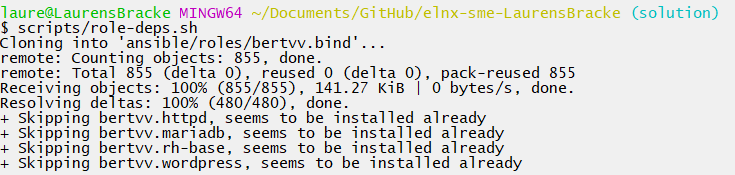
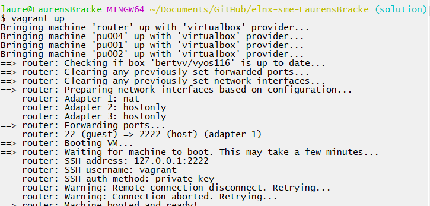
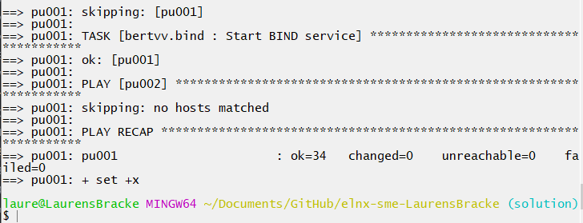
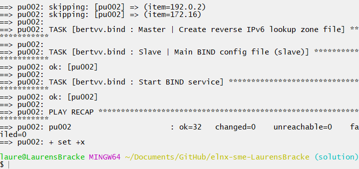
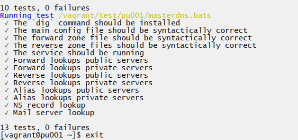
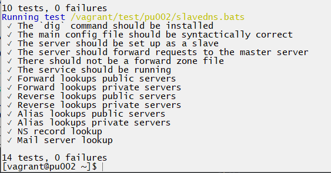
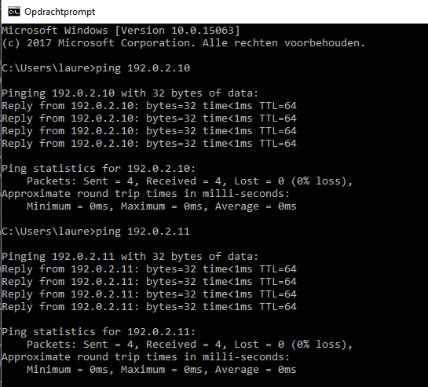

# Enterprise Linux Lab Report

- Student name: Laurens Bracke
- Github repo: <https://github.com/HoGentTIN/elnx-sme-LaurensBracke.git>

Describe the goals of the current iteration/assignment in a short sentence.

## Test plan

1. On the host system, go to the local working directory of the project repository
2. Execute `vagrant status`
    - There should be VMs, `pu004`, `pu001` en `pu002` with status `not created`. If the VM does exist, destroy it first with `vagrant destroy -f <name vm>`
3. Execute `vagrant up`
    - The command should run without errors (exit status 0)
4. Log in on the server with `vagrant ssh pu001` and run the acceptance tests. They should succeed

    ```
    ✓ The `dig` command should be installed
    ✓ The main config file should be syntactically correct
    ✓ The forward zone file should be syntactically correct
    ✓ The reverse zone files should be syntactically correct
    ✓ The service should be running
    ✓ Forward lookups public servers
    ✓ Forward lookups private servers
    ✓ Reverse lookups public servers
    ✓ Reverse lookups private servers
    ✓ Alias lookups public servers
    ✓ Alias lookups private servers
    ✓ NS record lookup
    ✓ Mail server lookup

    13 tests, 0 failures
    ```
    Alle testen moeten slagen!
  5. Log in on the server with `vagrant ssh pu002` and run the acceptance tests. They should succeed

    ```
    ✓ The `dig` command should be installed
    ✓ The main config file should be syntactically correct
    ✓ The server should be set up as a slave
    ✓ The server should forward requests to the master server
    ✓ There should not be a forward zone file
    ✓ The service should be running
    ✓ Forward lookups public servers
    ✓ Forward lookups private servers
    ✓ Reverse lookups public servers
    ✓ Reverse lookups private servers
    ✓ Alias lookups public servers
    ✓ Alias lookups private servers
    ✓ NS record lookup
    ✓ Mail server lookup

    ```

  6. Vervolgens check je op jouw hostmachine of de DNS-service ook daar beschikbaar is en of in `/etc/resolv.conf` op de VM's de nameservers vermeld staan.


## Procedure/Documentation

1. Doorlezen van de verschillende documenten, links die je helemaal beneden in dit bestand kunt vinden.

2. We voegen aan `pu001` en `pu002` de verschillende rollen toe in de master-playbook

```Yaml
- hosts: pu001
  become: true
  roles:
    - bertvv.rh-base
    - bertvv.bind
- hosts: pu002
  become: true
  roles:
    - bertvv.rh-base
    - bertvv.bind
```

3. We voegen de rol bertvv.bind toe aan onze repository.



4. Eerst gaan we `pu001.yml` aanpassen. Allereerst zetten we de poort voor dns open.

```Yaml
rhbase_firewall_allow_services:
  - dns
```

5. Vervolgens stellen we de noodzakelijke dingen in die de master dns zal nodig hebben: het domein `avalon.lan`, de zone-netwerken, toelaten dat er queries worden uitgevoerd naar deze dns, dat hij luistert naar alle ipv4-adressen, welke de DNS-servers in ons netwerk zijn en als laatste alle hosts die zich bevinden in ons netwerk, samen met hun ip en hun alias. Ook de mail-server geven we de juiste voorkeursnummer mee.

OPLOSSING van FOUT: was vergeten mail te specifieren in `bind_zone_mail_servers`

```Yaml
bind_zone_name: 'avalon.lan'
bind_zone_networks:
  - '172.16'
  - '192.0.2'
bind_allow_query:
  - any
bind_listen_ipv4:
  - any
bind_zone_name_servers:
  - pu001
  - pu002
bind_zone_master_server_ip: 192.0.2.10
bind_zone_hosts:
  - name: r001
    ip: 192.0.2.254
    aliases:
      - gw
  - name: pu001
    ip: 192.0.2.10
    aliases:
      - ns1
  - name: pu002
    ip: 192.0.2.11
    aliases:
      - ns2
  - name: pu004
    ip: 192.0.2.50
    aliases:
      - www
  - name: pu003
    ip: 192.0.2.20
    aliases:
      - mail
  - name: pr001
    ip: 172.16.0.2
    aliases:
      - dhcp
  - name: pr002
    ip: 172.16.0.3
    aliases:
      - directory
  - name: pr010
    ip: 172.16.0.10
    aliases:
      - inside
  - name: pr011
    ip: 172.16.0.11
    aliases:
      - files
bind_zone_mail_servers:
  - name: pu003
    preference: 10
```

6. Als deze goed is ingesteld, kunnen we `vagrant provision pu001` uitvoeren en alle tests zullen slagen. Vervolgens gaan we over naar `pu002`, de slave-dns.
Deze krijgt dezelfde instellingen mee in zijn Yaml-file, enkel moeten we hier de `bind_zone_hosts` en de `bind_zone_mail_servers` hier uit laten, deze worden gekopiëerd van DNS-server ns1.
```Yaml
rhbase_firewall_allow_services:
  - dns
bind_zone_master_server_ip: 192.0.2.10
bind_zone_name: 'avalon.lan'
bind_zone_networks:
  - '172.16'
  - '192.0.2'
bind_allow_query:
  - any
bind_zone_name_servers:
  - pu001
  - pu002
bind_listen_ipv4:
  - any
```

7. Alle testen voor `pu002` moeten ook slagen na `vagrant provision`.

## Test report

Bij `vagrant status` hebben we eerst moeten destroyen.

Daarna konden we `vagrant up` uitvoeren.



Vervolgens wordt machine opgestart zoals normaal en wordt het playbook uitgevoerd. We kunnen ook het commando `vagrant provision` nog eens laten lopen voor zowel `pu001` als voor `pu002`.




We voeren de testen uit die in de map scripts/test zitten, deze leveren geen fouten op.

Eerst voor `pu001`:



Dan voor `pu002`:



Alle requirements zijn voltooid.

Ook het pingen naar de DNS-VM's lukt vanaf de hostmachine.



## Resources

* https://galaxy.ansible.com/bertvv/bind/ (en de playbook hiervan)

* Commando's:
  - sudo firewall-cmd --list-all
  - sudo journalctl -u named
  - sudo journalctl -f -u named
  - sudo firewall-cmd reload
