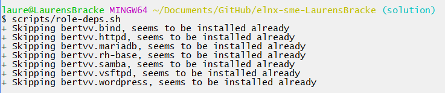
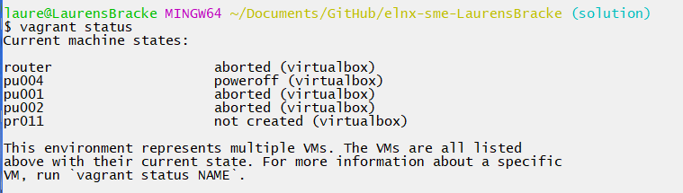
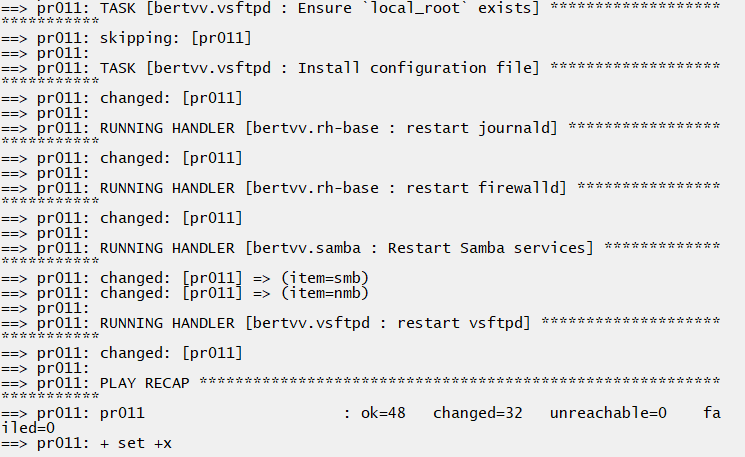
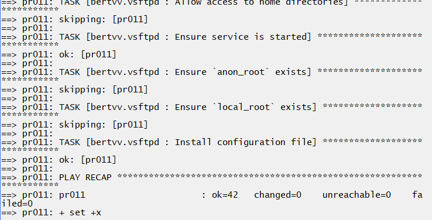
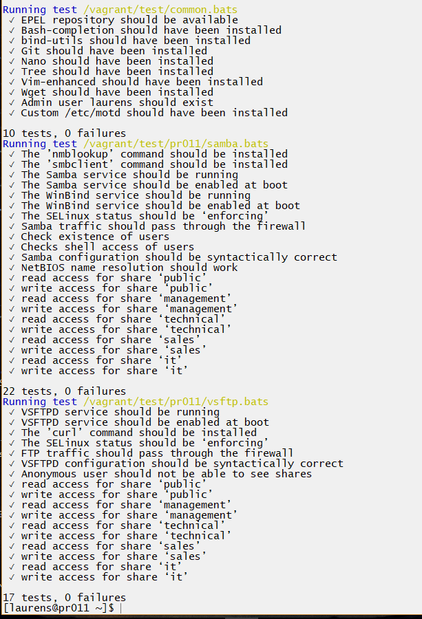
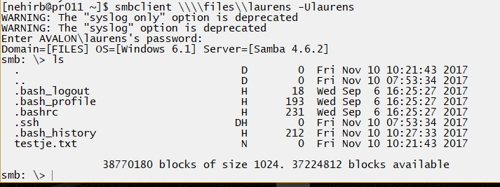
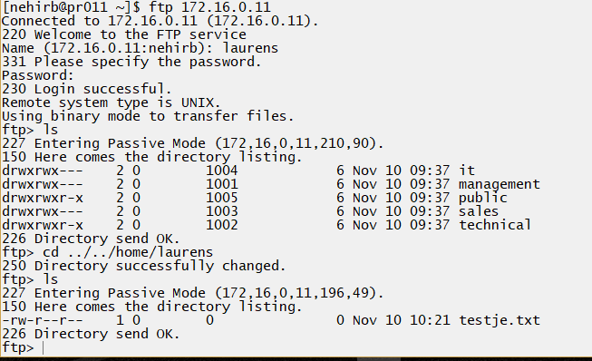
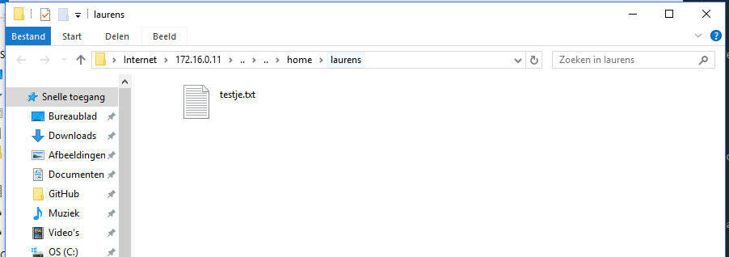

# Enterprise Linux Lab Report

- Student name: Laurens Bracke
- Github repo: <https://github.com/HoGentTIN/elnx-sme-LaurensBracke.git>

Describe the goals of the current iteration/assignment in a short sentence.

## Test plan

1. On the host system, go to the local working directory of the project repository
2. Execute `vagrant status`
    - There should be VMs, `pu004`, `pu001`, `pu002` and `pr011` with status `not created`. If the VM does exist, destroy it first with `vagrant destroy -f <name vm>`
3. Execute `vagrant up`
    - The command should run without errors (exit status 0)
4. Log in on the server with `vagrant ssh pr011` and run the acceptance tests. They should succeed

    ```
    ✓ The `dig` command should be installed
    ✓ The main config file should be syntactically correct
    ✓ The forward zone file should be syntactically correct
    ✓ The reverse zone files should be syntactically correct
    ✓ The service should be running
    ✓ Forward lookups public servers
    ✓ Forward lookups private servers
    ✓ Reverse lookups public servers
    ✓ Reverse lookups private servers
    ✓ Alias lookups public servers
    ✓ Alias lookups private servers
    ✓ NS record lookup
    ✓ Mail server lookup

    13 tests, 0 failures
    ```
    Alle testen moeten slagen!

5. Test of het mogelijk is om naar de bestanden te surfen en je in te loggen met de gebruikersnamen en wachtwoorden van users, zowel voor ftp als voor smb.

## Procedure/Documentation

1. Doorlezen van de verschillende documenten, links die je helemaal beneden in dit bestand kunt vinden.

2. We voegen pr011 toe aan de `vagrant-hosts.yml`.

```yaml
- name: pr011
  ip: 172.16.0.11
```

3. Daarnaast gaan we terug in de site.yml deze host toevoegen, en de juiste rollen toevoegen.

```yaml
- hosts: pr011
  become: true
  roles:
    - bertvv.rh-base
    - bertvv.samba
    - bertvv.vsftpd
```

4. Eerst gaan we Samba toevoegen. We maken in de map `host_vars` een nieuw bestand: `pr011.yml`.

5. We voegen de regels voor de firewall eerst toe.

```yaml
rhbase_firewall_allow_services:
  - samba
  - ftp
```

6. Nu gaan we de basisinstellingen toevoegen voor samba. We voegen een NETBIOS naam en zijn workgroup/domein toe aan de server.
Daarnaast nog een kleine verwelkoming. Verder stellen we in dat alle gebruikers hun home-map kunnen zien, en dat gasten niet worden toegelaten.
De root waarin alle shares zich bevinden is `samba_shares_root: /srv/samba`.

```yaml
samba_netbios_name: FILES
samba_server_string: 'Welkom op de Samba-server'
samba_workgroup: AVALON

samba_load_homes: true
samba_create_varwww_symlinks: true
samba_map_to_guest: Never
samba_shares_root: /srv/samba
```

7. Nu gaan we alle shares aanmaken die moeten bestaan op deze server voor Samba.
We stellen een naam in, een comment, van welke groep van users deze share is, welke users er op mogen lezen en welke mogen schrijven. `directory_mode` zorgt ervoor dat enkel de user en groepen aan deze share/map kunnen, en niet de other-group.

```yaml
samba_shares:
  - name: management
    comment: 'share voor management-groep'
    group: management
    valid_users: +management
    write_list: +management
    directory_mode: 770
  - name: technical
    comment: 'share voor technical-groep'
    group: technical
    write_list: +technical
  - name: sales
    comment: 'share voor sales-groep'
    group: sales
    valid_users: +management, +sales
    write_list: +sales
    directory_mode: 770
  - name: it
    comment: 'share voor it-groep'
    group: it
    valid_users: +management, +it
    write_list: +it
    directory_mode: 770
  - name: public
    comment: 'voor iedere gebruiker'
    group: public
    write_list: +public
```

8. Als laatste voor Samba moeten we nu natuurlijk nog deze users aanmaken, met hun respectievelijke groepen waartoe ze behoren. Sommige krijgen toegang om te mogen inloggen op de shell, anderen niet.
Afhankelijk van de groepen waartoe ze behoren, gaan ze kunnen kijken/schrijven naar een bepaalde share.

Eerst gaan we in `pr011.yml` de samba_users aanmaken.

```yaml
samba_users:
  - name: alexanderd
    password: alexanderd
  - name: anc
    password: anc
  - name: benoitp
    password: benoitp
  - name: christophev
    password: christophev
  - name: elenaa
    password: elenaa
  - name: evyt
    password: evyt
  - name: krisv
    password: krisv
  - name: leend
    password: leend
  - name: nehirb
    password: nehirb
  - name: stefaanv
    password: stefaanv
  - name: stevenh
    password: stevenh
  - name: stevenv
    password: stevenv
  - name: svena
    password: svena
  - name: laurens
    password: voetbal
```

in de `all.yml` gaan we nu de echte users aanmaken, enkel samba-users zijn niet genoeg, want de samba-users zitten vast aan de werkelijke users. Elke users behoort tot de groepen die worden aangemaakt voor samba. We zorgen er ook voor dat de paswoorden weer zijn versleuteld, met het commando dat we ook hebben gebruikt bij report 0 ( `openssl passwd -salt 1 -1 ***wachtwoord***' `).

```yaml
rhbase_user_groups:
  - management
  - technical
  - sales
  - it
  - public


rhbase_users:
  - name: laurens
    comment: 'Administrator'
    password: '$1$1$t.6go1hDMyB4zBqixr0q4/'
    groups:
      - wheel
      - it
      - public
  - name: alexanderd
    comment: 'Alexander De Coninck'
    password: '$1$1$EcU5ExEm4VTJVDisziEDS0'
    shell: /sbin/nologin
    groups:
      - technical
      - public
  - name: anc
    comment: 'An Coppens'
    password: '$1$1$wLhbf2gCmObdjsqY3cdZE1'
    shell: /sbin/nologin
    groups:
      - technical
      - public
    ......
```

9. Normaal werkt nu de Samba-server en kunnen we door naar de config voor VSFTPD.

10. We voegen zoals bij de samba-rol, nu de vsftpd-rol toe aan de `site.yml` en laden deze door het commando `role-deps.sh` weer op.

11. Vervolgens geven we in `pr011.yml` de config mee. We zorgen dat de root waarin vsftpd zoekt dezelfde is als onze SAMBA-share. Beide protocollen moeten namelijk dezelfde bestanden aanspreken. Door `vsftpd_local_enable` laten we enkel aangemaakte users toe, tegelijkertijd voeren we door `vsftpd_anonymous_enable` uit dat gast-gebruikers niet op deze share kunnen.

Verder geven we nog enkele kleine niet-functionele opties mee.

```yaml
vsftpd_local_enable: true
vsftpd_anonymous_enable: false
vsftpd_local_root: /srv/samba

vsftpd_options:
  - key: delete_failed_uploads
    value: 'YES'
  - key: ftpd_banner
    value: "Welcome to the FTP service"
  - key: use_localtime
    value: 'YES'

```

12. Nu zal alles werken, behalve de management group kan nog niet lezen in de sales-share en de it-share. Dit kunnen we oplossen door het volgende toe te voegen als post_tasks aan `pr011` in de `site.yml`.


```yaml

post_tasks:
  - name: ACL Sales
    acl:
      path: /srv/samba/sales/
      etype: group
      entity: management
      permissions: rx
      state: present
  - name: ACL It
    acl:
      path: /srv/samba/it/
      etype: group
      entity: management
      permissions: rx
      state: present

```

13. Normaal zijn nu alle permissies voor elke gebruiker correct ingesteld, zowel FTP als SMB.

## Test report

- We hebben eerst `scripts/role-deps` uitgevoerd om zeker te zijn dat alle repo's zijn toegevoegd.



- Bij `vagrant status` hebben we eerst moeten destroyen.

- Daarna konden we `vagrant up` uitvoeren.



- Vervolgens wordt machine opgestart zoals normaal en wordt het playbook uitgevoerd. We kunnen ook het commando `vagrant provision` nog eens laten lopen voor zekerheid.




- We voeren de testen uit die in de map scripts/test zitten, deze leveren geen fouten op.



- Nu kijken we verder naar het testen van Samba en VSFTPD. We hebben om te testen een file `testje.txt` aangemaakt in de home-dir van de admin. Normaal moeten we hieraan kunnen via zowel het smb als ftp protocol wanneer je bent ingelogd als een andere user (vagrant).

**Eerst voor SMB**



**Vervolgens voor FTP**



- We kunnen er ook aan via de file_explorer van de host via ftp.



Alle requirements zijn voltooid.


## Resources

* https://github.com/bertvv/ansible-role-samba

* https://galaxy.ansible.com/bertvv/vsftpd/
