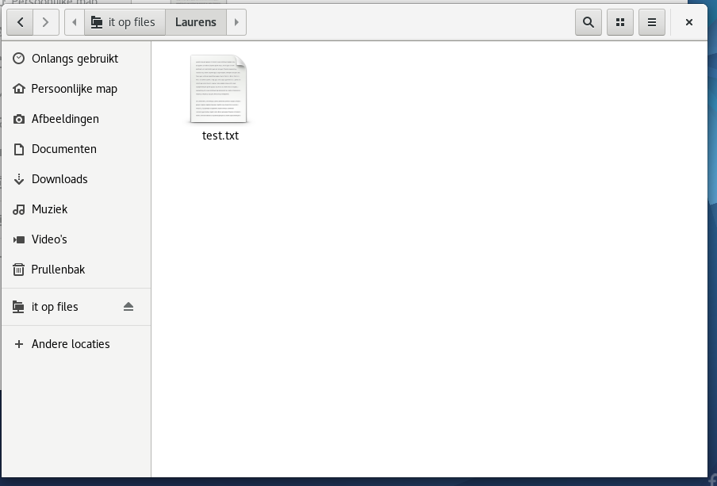

# Enterprise Linux Lab Report

- Student name: LaurensBracke
- Github repo: <https://github.com/HoGentTIN/elnx-LaurensBracke.git>

Describe the goals of the current iteration/assignment in a short sentence.

## Test plan

1. On the host system, go to the local working directory of the project repository

2. Execute `vagrant status`
    - There should be VMs, `pu004`, `pu001`, `pu002` and `pr011` with status `not created`. If the VM does exist, destroy it first with `vagrant destroy -f <name vm>`

3. Execute `vagrant up`
    - The command should run without errors (exit status 0)

4. Als we alle boxen destroyen eerst, en dan een volledige vagrantup doen, zouden alle testen moeten slagen, en moeten services zoals FTP, SMB, DHCP, DNS en Webserver allemaal zichtbaar zijn via een aangemaakte VM

5. Via de VM moeten we kunnen inloggen als meerdere personen in FTP en SMB-server, en moeten de juiste restricties voor die persoon toegepast zijn.

6. Het moet mogelijk zijn op vanop deze VM te surfen naar `avalon.lan/wordpress`, op deze manier testen we DNS en de Webserver.

7. We kijken of de 2 Host-Only netwerken van de VM de juiste DHCP instellingen hebben gekregen.

8. We kijken of de VM ook internettoegang heeft.

## Procedure/Documentation

1. Doorlezen van de verschillende documenten

2. We gaan eerst **de server `pr001`** toevoegen aan onze opstelling. We gaan dus eerst volgende lijn toevoegen aan `vagrant-hosts.yml`:

```yaml
- name: pr001
  ip: 172.16.0.2
```

3. We voegen host `pr001` toe aan de `site.yml`. De rol DHCP wordt extra toegevoegd aan de basisconfig.

```yaml
- hosts: pr001
  become: true
  roles:
    - bertvv.rh-base
    - bertvv.dhcp
```

4. We hebben deze rol nog niet gedownload, dus moeten we eerst de bestanden daarvoor downloaden via het commando `scripts/role-deps.sh`


5. We maken in de map `host_vars` vervolgens het bestand `pr001.yml` aan.

6. Zoals bij elke server die we tot nu toe hebben gemaakt, gaan we eerst de firewall-instellingen verzorgen via de rhbase-rol.

```yaml
rhbase_firewall_allow_services:
  - dhcp
```

7. Nu kunnen we beginnen aan de echte **configuratie van de DHCP-server**. We definiëren eerst alle globale DHCP variabelen. Zo zal voor alle verschillende pools bepaalde instellingen altijd dezelfde blijven, zoals bijvoorbeeld de lease-tijd van een IP-adres en onze domeinnaam. De global DNS-server kan onze server terugvinden via de routerinterface waar ons lokaal netwerk op zit aangesloten.

```yaml
dhcp_global_domain_name_servers:
  - 172.16.255.254
dhcp_global_default_lease_time: 43200
dhcp_global_max_lease_time: 43200 # 12 hrs
dhcp_global_domain_name: avalon.lan
```

8. Eerst gaan we nu op de DHCP-server aangeven in welk subnet alle ip-config zal verlopen.
We geven dus het `172.16.0.0` met een subnetmask /16. We geven ook het ip-adres mee van de routerinterface die hoort bij dit subnet.

```yaml
dhcp_subnets:
  - ip: 172.16.0.0
    netmask: 255.255.0.0
    routers: 172.16.255.254
```

9. Nu definiëren we de verschillende pools. We maken een pool dat statische ip's verdeelt, die vastzitten aan mac-adressen, en daarnaast een pool die dynamisch adressen uitdeelt.

```yaml
dhcp_subnets:
  - ip: 172.16.0.0
    netmask: 255.255.0.0
    routers: 172.16.255.254
    pools:
      - range_begin: 172.16.128.1
        range_end: 172.16.191.254
      - range_begin: 172.16.192.1
        range_end: 172.16.255.253
```

10. We maken nu al een lege VM aan in VirtualBox, die we later gaan gebruiken als **werkstation**. we stellen volgende kaarten in, en slaan van de eerste netwerkadapter het MAC-adres op.

We zorgen dat beide netwerkadapters deze zijn die horen bij het aangemaakte subnet op onze DHCP-server.


We slaan nu volgend MAC-adres op.


11. We gaan nu dit MAC-adres koppelen aan een ip-adres van onze eerste pool. We definiëren daarvoor een host.

```yaml
dhcp_hosts:
  - name: werkstation
    mac: '08:00:27:1E:41:47'  # eerste adapter van Fedora 25
    ip: 172.16.128.10
```

12. Na dit krijgt onze 2de netwerkadapter nog steeds een adres uit de eerste pool, wat niet de bedoeling is, daarom moeten we ervoor zorgen dat alle MAC-adressen, gemaakt door Virtualbox, wel worden toegelaten tot pool 2, en niet tot pool 1 tenzij hij gedefinieerd is als host.

We maken eerst een global class aan, die we later dan toevoegen aan de juiste pools.

```yaml
dhcp_global_classes:
  - name: vbox
    match: 'match if binary-to-ascii(16,8,":",substring(hardware, 1, 3)) = "8:0:27"'
```

13. Nu de klasse gemaakt is, kunnen we via de keywords `deny` en `allow` ervoor zorgen dat al onze netwerkadapters van de VM de juist instellingen doorkrijgen.

```yaml
dhcp_subnets:
  - ip: 172.16.0.0
    netmask: 255.255.0.0
    routers: 172.16.255.254
    pools:
      - range_begin: 172.16.128.1
        range_end: 172.16.191.254
        deny: 'members of "vbox"'
      - range_begin: 172.16.192.1
        range_end: 172.16.255.253
        allow: 'members of "vbox"'
```

14. Hierna krijgt onze VM de juiste instellingen!

15. Nu gaan we door met de **instellingen van onze router**.

16. Eerst voeren we op Git Bash volgend commando uit, hiermee zorgen we ervoor dat Vagrant ook overweg kan met config van VyOs.

´´´
vagrant plugin install vagrant-vyos
´´´

17. Nu gaan we naar het bestand `router-config.sh`. Hier gaan we verschillende instellingen meegeven, waardoor we later op het internet kunnen en ook vanop het intern netwerk het publieke netwerk kunnen bereiken.

18. We starten met de globale instellingen, bijvoorbeeld de naam van de router + de ssh poort die we openzetten.

```sh
# hostname definieren
set system host-name 'Router'
# poort openzetten voor ssh
set service ssh port '22'
```

19. Vervolgens gaan we de 3 interfaces instellen zoals gevraagd in de opgave.

```sh
# interfaces declareren
set interfaces ethernet eth0 address dhcp
set interfaces ethernet eth0 description "WAN link"
set interfaces ethernet eth1 address 192.0.2.254/24
set interfaces ethernet eth1 description "DMZ"
set interfaces ethernet eth2 address 172.16.255.254/16
set interfaces ethernet eth2 description "internal"
```

20. Nu gaan we verschillende NAT-rules toevoegen. De eerste is om van het privenetwerk naar buiten te geraken, en het andere om van het privenetwerk naar de publieke servers te geraken.

```sh
# eerste nat-rule: verzorgen dat prive subnet vertaald wordt naar buiten
# De IP's van het intern netwerk ondergaan translatie, zodat ze gebruikt kunnen worden via de WAN-poort
set nat source rule 10 description "Van Intern naar buiten"
set nat source rule 10 outbound-interface 'eth0'
set nat source rule 10 source address 172.16.0.0/16
set nat source rule 10 translation address 'masquerade'

# tweede nat-rule: verzorgen dat prive subnet geraakt in het net van de publieke servers
# De IP's van het intern netwerk ondergaan translatie, zodat ze gebruikt kunnen worden bij de publieke servers
set nat source rule 20 description "Van Intern naar DMZ"
set nat source rule 20 outbound-interface 'eth1'
set nat source rule 20 source address 172.16.0.0/16
set nat source rule 20 translation address 'masquerade'
```

21. Als laatste gaan we alle instellingen over DNS meegeven. We stellen onze router in als forwarding server, deze router gaat dus de verbinding leggen naar het internet. Alle aanvragen van de 2 DNS-servers gaat hij doorsturen naar de forwarding dns-server: `10.0.2.3` (DNS-server die gebruikt wordt door Virtualbox).

```sh
# zet het dns forwarding systeem aan
set service dns forwarding system

# stel de dns forwarding servers in voor het resolven in het domein
set service dns forwarding domain avalon.lan server 192.0.2.10
set service dns forwarding domain avalon.lan server 192.0.2.11

# dns forwarding voor internettoegang in privenetwerk
set service dns forwarding name-server 10.0.2.3

## 2 'interne' interfaces instellen als input poorten voor naar het internet te gaan
set service dns forwarding listen-on 'eth1'
set service dns forwarding listen-on 'eth2'
```

22. Voor NTP geven we het volgende mee, we deleten de standaard, en voegen de belgische toe aan de config:

```sh
delete system ntp server 0.pool.ntp.org
delete system ntp server 1.pool.ntp.org
delete system ntp server 2.pool.ntp.org
set system ntp server 0.be.pool.ntp.org prefer
set system ntp server 1.be.pool.ntp.org
set system ntp server 2.be.pool.ntp.org
set system ntp server 3.be.pool.ntp.org
set system time-zone Europe/Brussels
```

23. Nu voeren we in Git Bash een provision uit van onze router. Nu zou normaal alle instellingen voltooid kunnen zijn, en kunnen we via een workstation (Fedora 25 hier) testen of ons volledig domein bereikbaar is met al zijn services, of deze services werken vanaf dit werkstation, en of we internetconnectie hebben.


## Test report

1. We gaan nu ons volledige opstelling/netwerk testen. We destroyen alle VM's en de router (het werkstation kunnen we moeilijk iedere keer opnieuw destroyen).


2. We checken nu of alle VM's niet gecreëerd zijn.


3. Nu kunnen we vervolgens het befaamde commando `vagrant up` uitvoeren. Alle provisions zouden zonder errors moeten voltooien en de testen van alle servers apart moeten slagen.


* als laatste overloop hij de DHCP-server, en eindigt het `vagrant up`-commando zonder fouten


* Nu alle testen die we uitvoeren op de servers als we ingelogd zijn via het commando `sudo /vagrant/test/runbats.sh`


4. Nu gaan we via het commando smbclient, als 2 verschillende users, elk in hun eigen share een persoonlijke map aanmaken. Dit kunnen we later gebruiken om te testen.

**PS: ik weet nu dat smbclient gebruik maakt van forward-slashes, en niet dus zoals hieronder!**

```
[vagrant@pr011 ~]$ smbclient \\\\FILES\\technical -U evyt
WARNING: The "syslog only" option is deprecated
WARNING: The "syslog" option is deprecated
Enter AVALON\evyt's password:
Domain=[FILES] OS=[Windows 6.1] Server=[Samba 4.6.2]
smb: \> mkdir MapVanEvy
smb: \>


[vagrant@pr011 ~]$ smbclient \\\\FILES\\it -U laurens
WARNING: The "syslog only" option is deprecated
WARNING: The "syslog" option is deprecated
Enter AVALON\laurens's password:
Domain=[FILES] OS=[Windows 6.1] Server=[Samba 4.6.2]
smb: \> mkdir Laurens
```

5. Nu starten we onze eigen VM op (workstation1) en loggen we in als de administrator van het domein (laurens, met wachtwoord voetbal).


6. We testen eerst of onze machine de juiste ip-instellingen heeft gekregen van de DHCP-server. De eerste adapter moet uit de eerste pool komen, de 2de adapter is een Dynamisch adres uit de 2de pool

Dit adres is toegewezen aan het specifieke MAC-adres van deze adapter.


Dit adres komt uit de 2de pool


**DNS-instellingen zijn ok, en de Default gateway is OK.**

7. We testen nu of we via Firefox kunnen surfen naar `www.avalon.lan/wordpress`.
Hiermee testen we zowel DNS als de Webserver. Dit lukt!


8. Vervolgens testen we nog Samba en FTP. Nu kunnen we via 'Bestanden' -> Netwerk het netwerk 'Windows-netwerk' zien staan. Dit maakt gebruik van het SMB-protocol.


9. Als we nu klikken op een map, kunnen we inloggen als de gebruiker die we willen op onze fileserver.

We proberen nu eens in te loggen als Evy in de map IT, wat niet mag lukken!

 * Dit klopt, ik blijf dit scherm krijgen


Nu loggen we in de map IT in als laurens (admin). Dit lukt, en we zien de persoonlijke map van Laurens, die zojuist was aangemaakt.


In de map Laurens, maak ik nu een testbestand aan.



**Ditzelfde doe ik ook bij de persoonlijke map van Evy (MapVanEvy), daar kopieer ik ook hetzelfde bestand in, dit kunnen we dan gebruiken om aan te tonen dat Evy geen rechten heeft om aan het bestand van Laurens te geraken, maar wel omgekeerd! --> Dit zullen we testen straks dan met FTP**

Ingelogd als Evy:


10. We gaan nu testen met bijvoorbeeld FTP kijken of we zomaar als evy bij het bestand van laurens geraken in de IT-share.

We voeren nu ook in Bestanden het volgende in: `ftp://files`

We loggen in als Evy met het protocol FTP!


Als we nu gaan naar de map van Laurens krijgen we volgende error:


Nu loggen we in als Laurens, en gaan we kijken of we het bestand van Evy kunnen aanpassen:


en als IT'er kan je dus wel files aanpassen in Technical, zoals het hoort!


11. We kunnen ook via de webbrowser surfen naar onze shares

Eerst via smb:


Vervolgens via ftp:


12. Door alle vorige acties is getest dat de router ons kan leiden naar de publieke servers die we gemaakt hebben, nu moeten we nog testen dat we internet hebben voor ons intern netwerk.

We proberen te surfen naar een website naar keuze: https://www.vrtnws.be


Alle requirements zijn voltooid, en de SME-opdracht is afgewerkt.


## Resources

* https://galaxy.ansible.com/bertvv/dhcp/

* https://bertvv.github.io/cheat-sheets/VyOS.html

* https://wiki.vyos.net/wiki/
