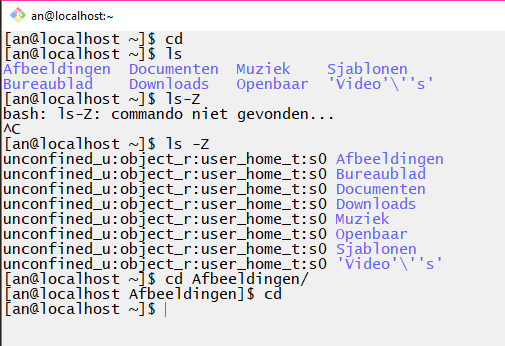

# Actualiteitsopdracht: SYSDIG

- Student name: Laurens Bracke
- Github repo: <https://github.com/HoGentTIN/elnx-sme-LaurensBracke.git>

## Verantwoording keuze voor Sysdig

Tijdens de eerste les van het vak ben ik terecht gekomen op het volgende artikel:

https://www.linuxtoday.com/high_performance/how-to-monitor-linux-commands-executed-by-system-users-in-real-time-170914231009.html

Dit artikel rapporteerde over een manier om van alle users op een werkstation of server de commando's die ze gebruiken te monitoren, Sysdig genaamd. Aangezien we werken met een kleine testomgeving, waar normaliter verschillende users kunnen aangelogd zijn op het werkstation om de diensten van het domein avalon.lan te gebruiken, besloot ik toen al om ***de functionaliteit van sysdig om op users te spyen*** te nemen als onderwerp voor mijn actualiteitsopdracht.

## Wat is Sysdig precies?

Sysdig is een krachtig, open-source monitoring systeem dat deels ook kan gebruikt worden als troubleshooting-tool voor Linux-systemen. Het werkt zelfs voor Mac OSX of Windows, alleen is daar de functionaliteit nog beperkt.

Sysdig is ontstaan als antwoord op de vele verschillende programma's die al bestonden voor monitoring en troubleshooting, maar niet samen werden gebruikt. Als we kijken op de site van Sysdig, omschrijven ze zichzelf als een mix van verschillende tools waaronder:

- tcpdump, iftop en netstat (netwerk monitoring)
- htop en strace (process monitoring)
- lsof (mogelijkheid om te kijken welke files geopend worden door welke processen)

Het voordeel voor in een echte omgeving van dit programma is dat het niet enkel kan gebruikt worden voor 1 enkel systeem zijn info/events te capteren, op te slaan en te onderzoeken, maar ook voor een container. Wanneer je gecapteerde data hebt opgeslagen in een bestand, is het simpel om deze data te openen en te kijken wat er juist allemaal in die dag/week is gebeurd.

`sysdig` is het commando om dit programma te openen in een terminalvenster, maar het grote stokpaardje aan het programma is dat het komt met een duidelijke interactieve UI die geopend wordt in een terminalvenster. Hiervoor open je de tool met het commando `csysdig`.

## Doel van deze actualteitsopdracht

Mijn bedoeling is om Sysdig te installeren op het workstation, waar enkel de Admin recht heeft om deze applicatie te openen. Hij heeft dus enkel het recht om deze data te bekijken die Sysdig gecapteerd heeft. Ik wil een testopstelling maken waar verschillende users verschillende commando's (gebruik maken van fileserver, surfen naar avalon.lan, nieuwe files aanmaken in hun eigen HOME-directory... ) uitvoeren op 1 werkstation, die dan in real-time bekeken kunnen worden door de admin.

## Prerequisites Sysdig op werkstation

* Eerst en vooral gaan we meer users creëeren op het werkstation. Voor de SME-opdracht was het voldoende om 1 user te hebben (user Laurens met wachtwoord voetbal). **Voor deze opdracht gaan we nog 2 extra users aanmaken (An en Steven).**

We gebruiken hiervoor volgende commando's op het werkstation.

```
[root@localhost ~]# useradd an
[root@localhost ~]# useradd steven
[root@localhost ~]# passwd an
Wachtwoord voor gebruiker an veranderen.
Nieuw wachtwoord:
SLECHT WACHTWOORD: Het wachtwoord is korter dan 8 karakters
Nieuw wachtwoord herhalen:
passwd: alle authenticatie tokens zijn succesvol bijgewerkt.
[root@localhost ~]# passwd steven
Wachtwoord voor gebruiker steven veranderen.
Nieuw wachtwoord:
SLECHT WACHTWOORD: Het wachtwoord is korter dan 8 karakters
Nieuw wachtwoord herhalen:
passwd: alle authenticatie tokens zijn succesvol bijgewerkt.
[root@localhost ~]# su steven
[steven@localhost root]$
```

* Nu zijn deze users aangemaakt op het werkstation. We moeten ook zorgen dat Laurens(admin) op het werkstation in de groep wheel zit (deze geeft admin-rechten aan deze user). Zo kunnen we later sysdig openen als user Laurens, maar niet als An of Steven.

Door het commando `groups` kunnen we zien of Laurens al tot de admin-groep behoort.

```
[laurens@localhost ~]$ groups
laurens wheel
```

* Als laatste voorbereidende stap moeten we nu nog juist het mogelijk maken om onze andere users te laten inloggen via ssh op het werkstation. hiervoor activeren en enablen we ssh eerst, zo komt poort 22 open te staan. We zorgen daarbij ook voor een extra Host-only adapter op ons werkstation (192.168.56.101), anders is ssh niet mogelijk vanop de hostmachine.

```
[laurens@localhost ~]$ sudo systemctl start sshd.service
[laurens@localhost ~]$ sudo systemctl enable sshd.service
Created symlink /etc/systemd/system/multi-user.target.wants/sshd.service → /usr/lib/systemd/system/sshd.service.
[laurens@localhost ~]$
```

Nu kunnen we altijd via Git Bash inloggen als andere users op ons werkstation!

```bash
laure@LaurensBracke MINGW64 ~/Documents/GitHub/elnx-sme-LaurensBracke (solution)
$ ssh an@192.168.56.101
The authenticity of host '192.168.56.101 (192.168.56.101)' can't be established.
ECDSA key fingerprint is SHA256:p6XKRprWX3ZJmDSRMJa09OMSmJVm3EDi21RZhZsoX5Q.
Are you sure you want to continue connecting (yes/no)? yes
Warning: Permanently added '192.168.56.101' (ECDSA) to the list of known hosts.
an@192.168.56.101's password:
Last login: Tue Jan  2 13:58:57 2018
[an@localhost ~]$
```

Hier nog een voorbeeld van steven die inlogt en zich afvraagt welke user er ook momenteel ingelogd zijn op het werkstation.

```
[steven@localhost ~]$ users
an laurens steven
[steven@localhost ~]$ who
laurens  tty2         2018-01-02 14:14 (:1)
an       pts/1        2018-01-02 14:27 (192.168.56.1)
steven   pts/2        2018-01-02 14:30 (192.168.56.1)
[steven@localhost ~]$
```

## Installatie Sysdig op werkstation

We loggen in als user Laurens (non-root user met sudo permissies). Deze kan Sysdig installeren op de machine. Het installeren van Sysdig gebeurt via onderstaand commando. Dit gaat de package downloaden van de Draios-repository en vervolgens installeren.

```
curl -s https://s3.amazonaws.com/download.draios.com/stable/install-sysdig | sudo bash
```


Dit eindigt met "DKMS: install completed"

## Het programma opstarten

Na het installeren, moeten we de app opstarten als root omdat de app toegang nodig heeft tot kritieke gebieden op het systeem zoals bijvoorbeeld de /proc-map. Het is natuurlijk veiliger om niet als root in te loggen, maar als een user die wel root-privileges heeft. Gelukkig hebben we in de vorige stappen zo een gebruiker aangemaakt (Laurens)

```
$ sysdig   of      $ csysdig
```

Je krijgt volgende uitvoer:


Sysdig zal een stream creëren van informatie in je terminalvenster, waar Csysdig je een tekstgebasseerde applicatie in je terminal zal bieden.


Sysdig is veel geavanceerder en maakt het mogelijk om echt diep te graven in het systeem, waar Csysdig je een overzicht geeft.

* Gebruiker Laurens kan dit programma nu openen, maar dit betekent nog niet dat de andere users van het werkstation dit kunnen openen.


## Spyen op users

Nu komen we tot het werkelijk 'spieken bij de buren'. We kunnen dit aanpakken op 2 manieren. We kunnen kiezen om als admin in real-time te kijken wat de andere users op dit moment uitvoeren, of we kunnen kiezen om voor een bepaalde tijd te scannen, dit dan op te slaan in een bestandje om vervolgens later het bestand te openen en te kijken wat er juist allemaal in die tijd is gebeurd. Ik zal beide systemen toelichten.

### METHODE 1: Spyen in real-time

Om dit te kunnen doen, laten we An en Steven inloggen via ssh in dit voorbeeld, en laten we Laurens inloggen via Virtualbox. Wanneer Laurens het commando **sudo sysdig -c spy_users** uitvoert, dan krijgt hij een leeg zwart scherm te zien.

Telkens wanneer An of Steven een commando uitvoeren op het werkstation, krijgt Laurens als admin telkens een lijntje code erbij. Elk lijntje bevat het procesid, een timestamp, een gebruiker, en vervolgens het commando dat ze uitvoerden. Op deze manier zie je dan een verloop zoals getoond hieronder.


* Wat An uitvoerde



* Wat Steven uitvoerde


* Wanneer Steven of An proberen om hetzelfde commando uit te voeren als de admin om te spyen op anderen, krijgen zij een error + het incident wordt ook vermeld in de stroom van commando's die de admin te zien krijgt.


**We kunnen er ook altijd voor kiezen om via de UI (csysdig) de live stream te bekijken:**


**Nadeel van deze methode:**

- Je slaat niets op. Je kijkt naar de stroom maar het is niet dat je op een bepaald moment kan filteren of records van 2 dagen geleden kan bekijken. Daarom stellen we ook de 2de manier voor hieronder.

### METHODE 2: opslaan van stroom en herbekijken via csysdig

Eerst voeren we een commando in waarin we specifieren waar we de hele stroom zullen in opslaan. We voeren daarvoor volgend commando uit (we verkiezen het liefst om dit te laten openstaan in een 2de terminal die we ondertussen niet aanraken, kan je zelf kiezen wanneer je het afsluit (je kan ook `-C 1 -W 5` meegeven, zodat hij altijd alles zal opslaan in 5 bestanden van maximum 1 MB)):

**sudo sysdig -c spy_users -w spy.scap (user.name=steven)**

* Spy_users: dit geeft aan dat we enkel de commando's willen opslaan in dit bestandje
* spy.scap: dit is het formaat van de file waarin we de stroom gaan opslaan, dit komt normaal in de home-map van de admin terecht.
* user.name: we kunnen ook specifieren specifiek voor welke user we dit willen opslaan.


Stel nu dat we het willen lezen, dan moeten we onderstaand commando uitvoeren:

1. **sudo csysdig -r spy.scap user.name=steven**

* Hiermee kunnen we kijken welke activiteiten steven heeft ondernomen in die tijd. Als we dit commando gebruiken om te herbekijken, kiezen we best telkens een user.name


2. **sudo sysdig -r spy.scap -c spy_users**

* Dit commando is zeer goed om data te herbekijken zoals die is geformateerd in de eerste methode.


* Op die manier krijgen we mooi hetzelfde terug als toen we het live lieten lopen.


## Sysdig is veel meer dan dit...

Sysdig heeft nog veel meer in zijn mars. Ik heb er nu voor gekozen om deze nieuwe toevoeging aan sysdig te testen, maar oorspronkelijk is sysdig gemaakt als monitoring en troubleshooting-hulpmiddel. Er zijn verschillende views waarmee we de grote stream kunnen filteren naar ons doel. Standaard krijgen we als we csysdig openen, alle processen te zien met hun CPU- en geheugengebruik. We kunnen dan ook bijvoorbeeld filteren op `ssh` en dan krijgen we te zien welke users zijn ingelogd, en wat hun proces-id is.


**Nadeel Sysdig**

* Er is geen mogelijkheid om letterlijk wat ze intypen op te vangen. Zo kan ik toch niet volgen wat ze uiteindelijk doen wanneer ze de FTP-server willen bereiken. Ik kan als admin zien dat ze hebben ingelogd op de server, maar niet wat ze net hebben gedaan daar.

## Voorstelling op 23 januari

Aantonen van al deze functionaliteit door An en Steven een paar commando's te laten uitvoeren en deze achteraf te herbekijken als admin Laurens.


### Links

* https://linoxide.com/linux-command/linux-who-command/

* https://www.tecmint.com/monitor-linux-commands-executed-by-system-users-in-real-time/

* https://www.linuxtoday.com/high_performance/how-to-monitor-linux-commands-executed-by-system-users-in-real-time-170914231009.html

* https://www.sysdig.org/wiki/

* http://xmodulo.com/monitor-troubleshoot-linux-server-sysdig.html
